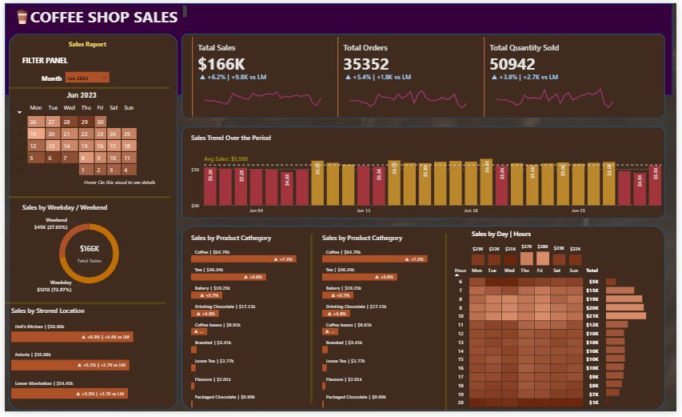

# ☕ Coffee Shop Sales Dashboard 📊

This Power BI project visualizes and analyzes sales data for a coffee shop, providing insights into total sales, order trends, quantity sold, and more. The dashboard offers detailed breakdowns by weekday/weekend, location, time, and product categories.

---
## 📷 Screenshots

### Dashboard Overview

### Drill Through

### Calendar Tooltip                                                         
           

### Day & Hour Tooltip

## 📁 Project Overview

This report is built in **Power BI** to help business stakeholders and data analysts understand:

- Overall Sales Performance
- Sales Trends by Date and Hour
- Performance by Product Category
- Location-wise Breakdown
- Weekend vs Weekday Analysis
- Interactive Filtering by Calendar

---

## 📊 Dashboard Highlights

### 🔸 Main Dashboard
- **Total Sales (June 2023)**: `$166K`
- **Total Orders**: `35,352`
- **Quantity Sold**: `50,942`
- Comparative indicators vs Last Month (LM)
- Visual filters: Calendar slicer, category, store, weekday/weekend
- Hourly heatmap for sales performance

### 🔸 Tooltips (Drill-through Visualizations)
- **Drill Through** (Detailed Information of Product Cathegory )
- **Calendar Tooltip** (Daily Breakdown)
- **Day & Hour Tooltip** (Detailed Hourly Insights)

### 🔸 Annual Summary View
- **January Total Sales**: `$698,812`
- **Total Orders**: `149,116`
- **Total Quantity Sold**: `214,470`

---

## 📌 Features Used

- ✅ DAX Calculations
- ✅ Custom Tooltips
- ✅ Calendar Visual
- ✅ Matrix and Bar Charts
- ✅ Donut Charts
- ✅ Heatmaps
- ✅ Slicers and Filters
- ✅ Dynamic Comparison with Last Month (LM)

---

## 🧰 Technologies

- **Power BI Desktop**
- **DAX**
- **Power Query (M)**
- **Data Modeling**

---
